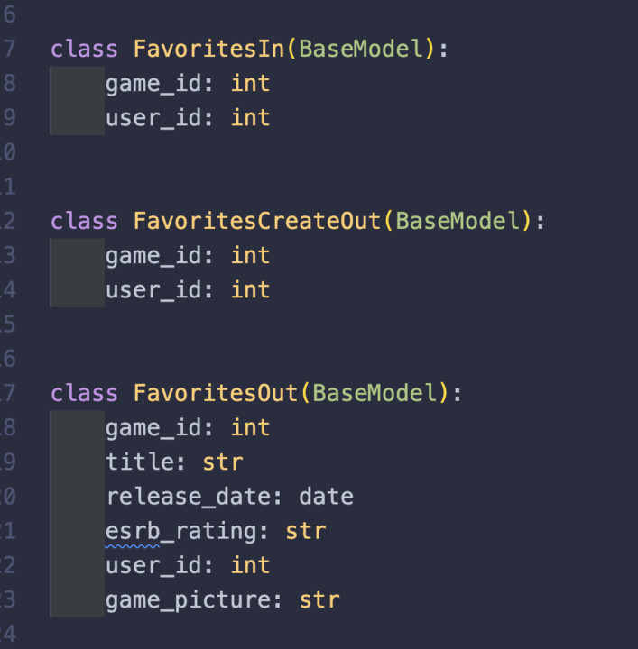
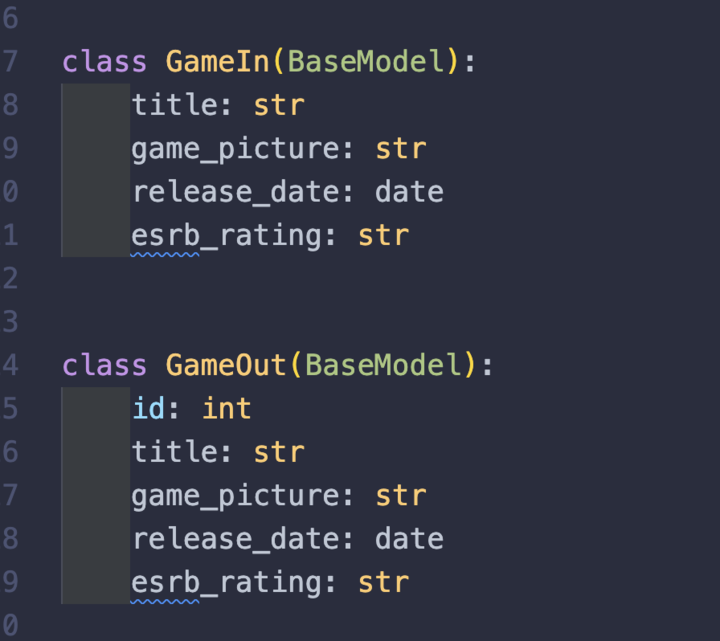
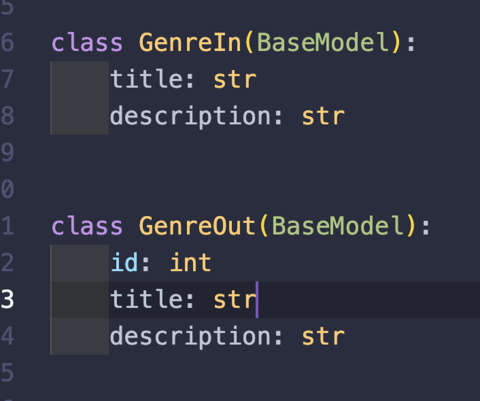
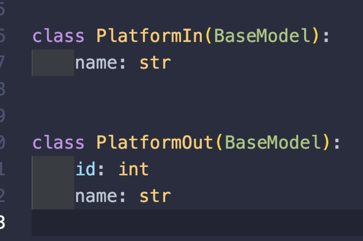
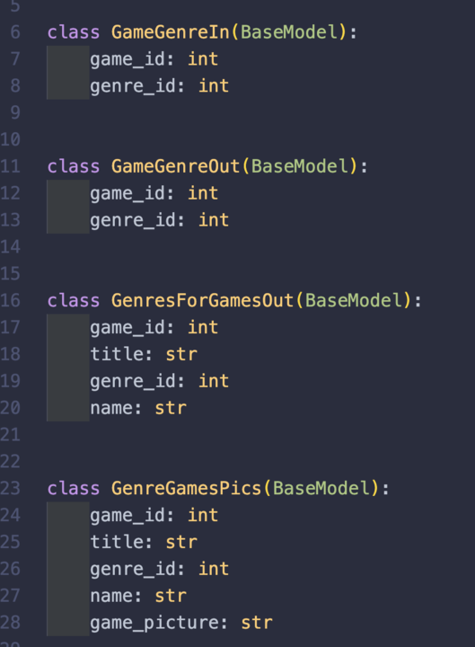
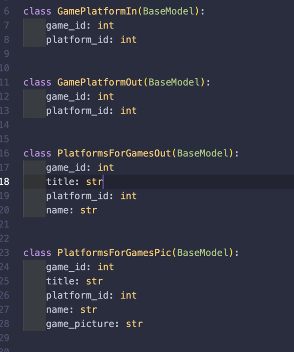
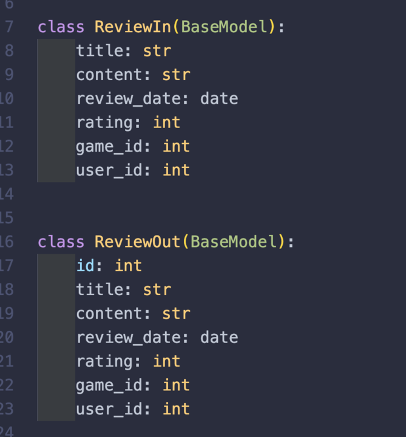
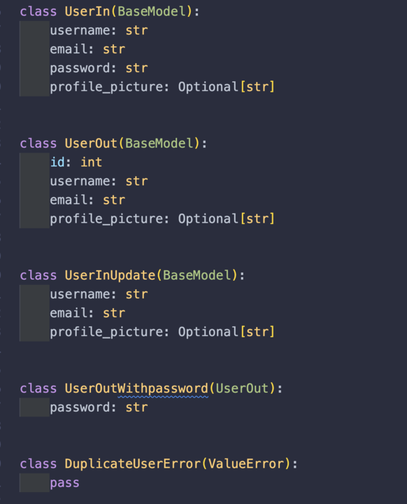
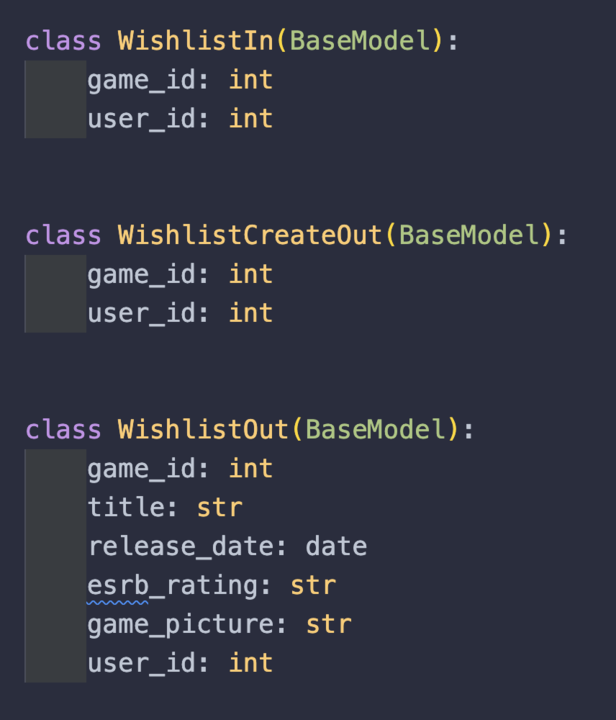
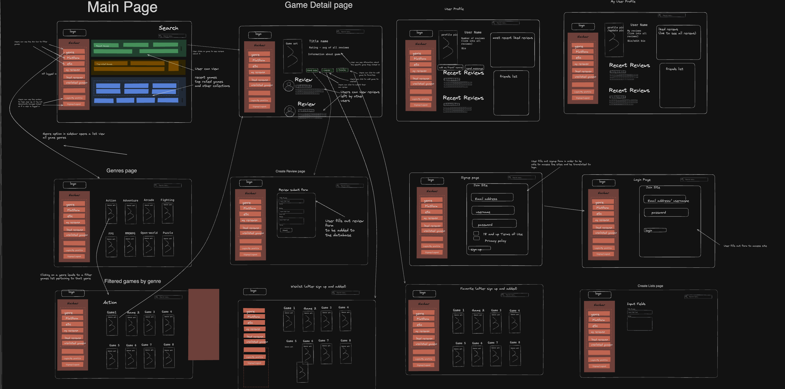

# Level-up reviews

We built a webpage for gamers to post reviews for games they enjoy. This website is powered by users and has no input from large game journalist reviews. We find that grass roots word of mouth is a lot more effective for popularity of games. we've seen this type of movement in gaming communities across the internet, where small indie games that players enjoy are outselling large corporate AAA games. We wanted to develop an app that allows for users to get their voices out there to other users.

Team:

- Oscar Gamez
- Juan Melendrez
- James Nguyen
- Peter Sayaseng

## Getting Started

Access the project at: https://pixel-pioneers.gitlab.io/level-up-reviews/

## Project URLS

- Get all users or create user:
  `${process.env.REACT_APP_API_HOST}$/users`
- Get a user, update, or delete:
  `${process.env.REACT_APP_API_HOST}$/users/${user_id}`
- Get all games
  `${process.env.REACT_APP_API_HOST}$/games`
- Get, Update, or Delete a game:
  `${process.env.REACT_APP_API_HOST}$/games/${game_id}`
- Get all platforms or create
  `${process.env.REACT_APP_API_HOST}$/platforms`
- Get all genres or create a genre:
  `${process.env.REACT_APP_API_HOST}$/genres`

## JSON shape examples

- Get all games

```
  {
  "games": [
  {
  "id": 17,
  "title": "Alan Wake",
  "game_picture": "https://media.rawg.io/media/games/5c0/5c0dd63002cb23f804aab327d40ef119.jpg",
  "release_date": "2010-05-14",
  "esrb_rating": "T"
  },
  {
  "id": 16,
  "title": "Amnesia: The Dark Descent",
  "game_picture": "https://media.rawg.io/media/games/b54/b54598d1d5cc31899f4f0a7e3122a7b0.jpg",
  "release_date": "2010-09-08",
  "esrb_rating": "M"
  }
  ]
  }
```

- Get all platforms

```
  {
  "platforms": [
  {
  "id": 4,
  "name": "PC"
  },
  {
  "id": 2,
  "name": "PS5"
  },
  {
  "id": 3,
  "name": "Switch"
  },
  {
  "id": 1,
  "name": "Xbox"
  }
  ]
  }
```

- Get all reviews

```
  {
  "reviews": [
  {
  "id": 1,
  "title": "great game",
  "content": "having a good time playing this",
  "review_date": "2023-12-11",
  "rating": 100,
  "game_id": 27,
  "user_id": 1
  }
  ]
  }
```

- Get all genres
  {
  "genres": [
  {
  "id": 3,
  "title": "Adventure",
  "description": "Story telling focused games"
  },
  {
  "id": 9,
  "title": "ARPG",
  "description": "Action RPG games"
  },
  {
  "id": 11,
  "title": "Farm Simulator",
  "description": "Farming games"
  }
  ]
  }

## Pydantic Models

- Favorites
  ]
- Games
  
- Genres
  
- Platforms
  
- Game/Genres
  
- Game/Platforms
  
- Reviews
  
- Favorites
  
- Wishlist
  

## Wireframe


