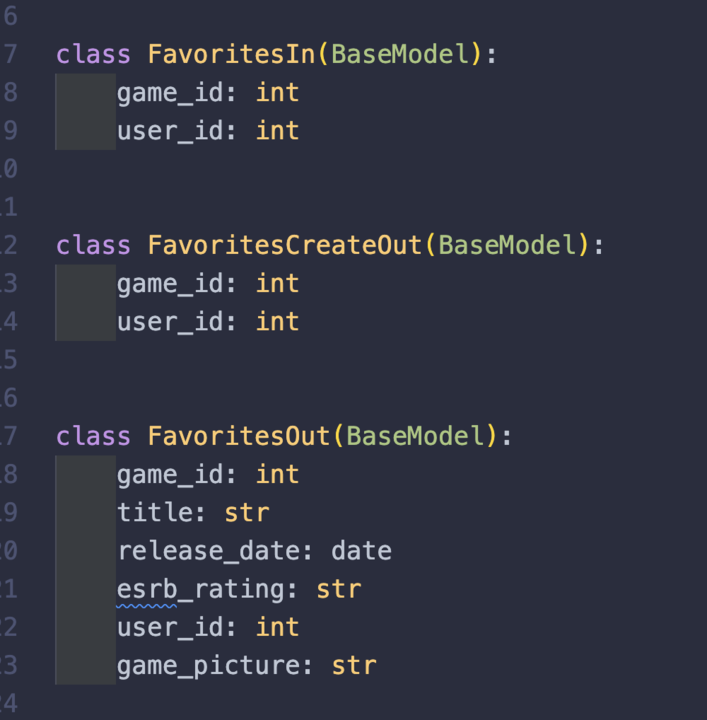
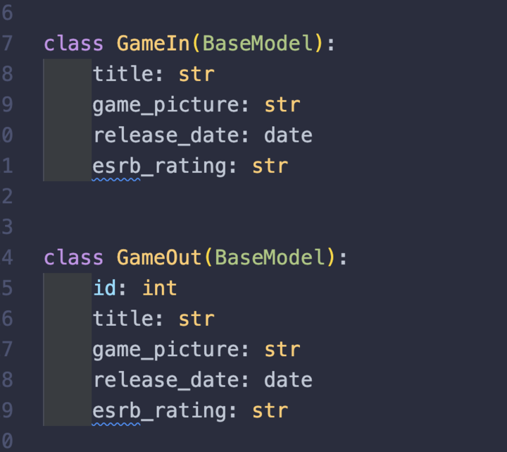
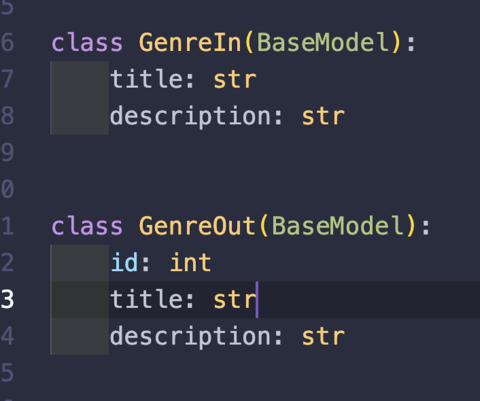
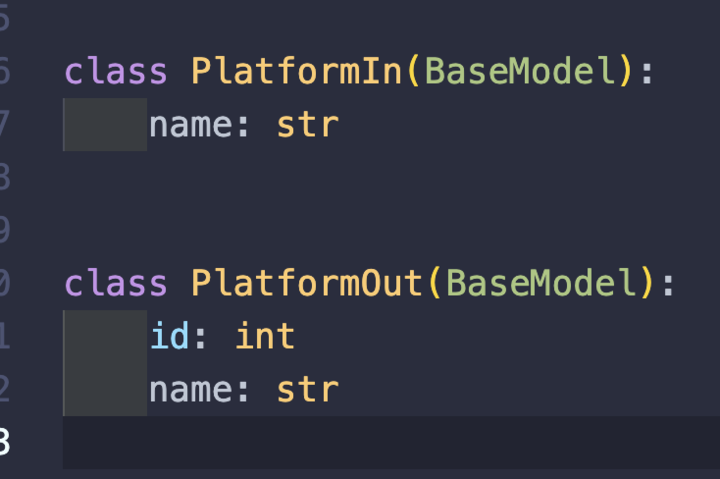
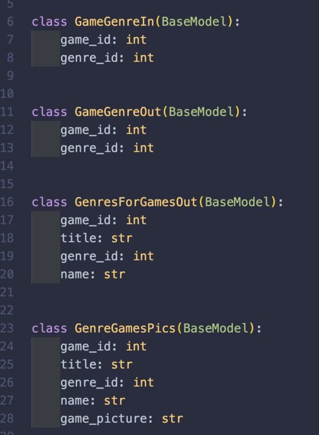
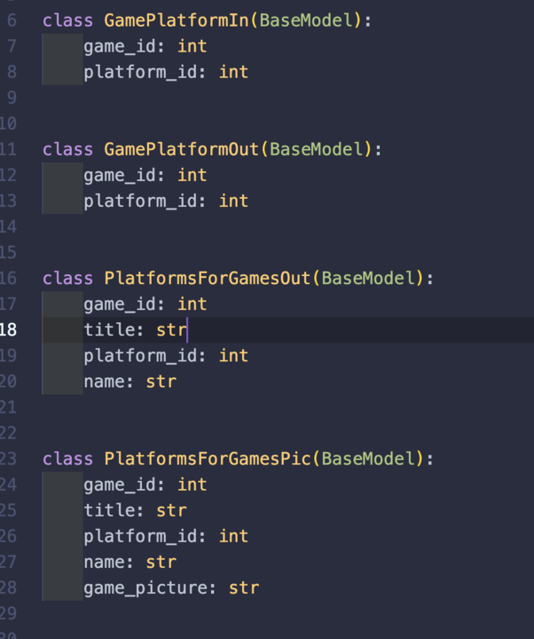
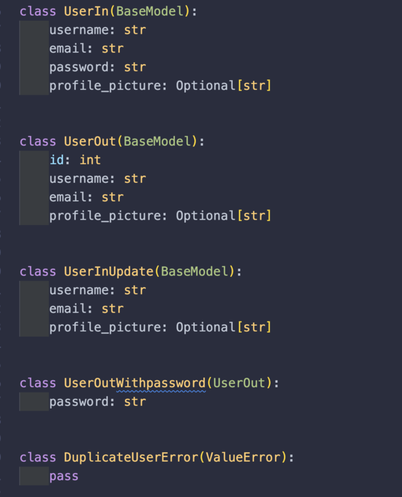
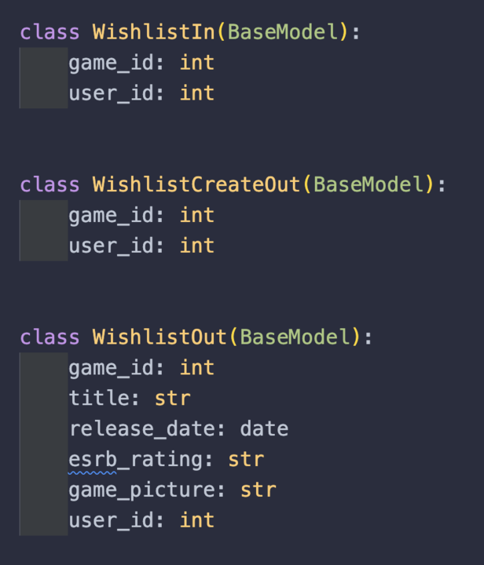

# Level-up reviews
We built a webpage for gamers to post reviews for games they enjoy. This website is powered by users and has no input from large game journalist reviews. We find that grass roots word of mouth is a lot more effective for popularity of games. we've seen this type of movement in gaming communities across the internet, where small indie games that players enjoy are outselling large corporate AAA games. We wanted to develop an app that allows for users to get their voices out there to other users.

Team:

* Oscar Gamez
* Juan Melendrez
* James Nguyen
* Peter Sayaseng

## Getting Started

Access the project at: https://pixel-pioneers.gitlab.io/level-up-reviews/

## Project URLS

- Get all users:
${process.env.REACT_APP_API_HOST}$/users
- Create user:
${process.env.REACT_APP_API_HOST}$/users
- Get a user:
${process.env.REACT_APP_API_HOST}$/users/${user_id}$
- Update user
${process.env.REACT_APP_API_HOST}$/users/${user_id}$
- Get all games
${process.env.REACT_APP_API_HOST}$/games
- Get a game
${process.env.REACT_APP_API_HOST}$/games/${game_id}$
- Update a game
${process.env.REACT_APP_API_HOST}$/games/${game_id}$
- Delete a game
${process.env.REACT_APP_API_HOST}$/games/${game_id}$
- Get all platforms
${process.env.REACT_APP_API_HOST}$/platforms
- Create platform
${process.env.REACT_APP_API_HOST}$/platforms
- Get all genres
${process.env.REACT_APP_API_HOST}$/genres
- Create a genre
${process.env.REACT_APP_API_HOST}$/genres
- Create a game/platforms
${process.env.REACT_APP_API_HOST}$/game_platforms
- Get all game/platforms
${process.env.REACT_APP_API_HOST}$/game_platforms
- Get all all platforms for game
${process.env.REACT_APP_API_HOST}$/games/${game_id}$/platforms
- Get platforms for game
${process.env.REACT_APP_API_HOST}$/platforms/${platform_id}$/games
- Get all game/genres
${process.env.REACT_APP_API_HOST}$/game_genres
- Create a game/platforms
${process.env.REACT_APP_API_HOST}$/game_genres
- Get games for genre
${process.env.REACT_APP_API_HOST}$/genres/{genre_id}$/games
- Get all reviews
${process.env.REACT_APP_API_HOST}$/reviews
- Create review
${process.env.REACT_APP_API_HOST}$/reviews
- Get all reviews for game
${process.env.REACT_APP_API_HOST}$/games/${game_id}$/reviews
- Get top rated
${process.env.REACT_APP_API_HOST}$/games/toprated
- Get all user reviews
${process.env.REACT_APP_API_HOST}$/users/${user_id}$/reviews
- Get reviews for mainpage
${process.env.REACT_APP_API_HOST}$/games/reviews/main
- Create a favorite
${process.env.REACT_APP_API_HOST}$/favorites
- Get all favorites for user
${process.env.REACT_APP_API_HOST}$/users/${user_id}$/favorites
- Create a wishlist game
${process.env.REACT_APP_API_HOST}$/wishlist
- Get a users wishlist
${process.env.REACT_APP_API_HOST}$/users/${user_id}$/wishlist
- Delete a wishlist item
${process.env.REACT_APP_API_HOST}$/wishlist/${game_id}$
- Delete a favorites item
${process.env.REACT_APP_API_HOST}$/favorites/${game_id}$

## JSON shape examples

- Get all games
{
  "games": [
    {
      "id": 17,
      "title": "Alan Wake",
      "game_picture": "https://media.rawg.io/media/games/5c0/5c0dd63002cb23f804aab327d40ef119.jpg",
      "release_date": "2010-05-14",
      "esrb_rating": "T"
    },
    {
      "id": 16,
      "title": "Amnesia: The Dark Descent",
      "game_picture": "https://media.rawg.io/media/games/b54/b54598d1d5cc31899f4f0a7e3122a7b0.jpg",
      "release_date": "2010-09-08",
      "esrb_rating": "M"
    }
  ]
}

- Get all platforms
{
  "platforms": [
    {
      "id": 4,
      "name": "PC"
    },
    {
      "id": 2,
      "name": "PS5"
    },
    {
      "id": 3,
      "name": "Switch"
    },
    {
      "id": 1,
      "name": "Xbox"
    }
  ]
}

- Get all reviews
{
  "reviews": [
    {
      "id": 1,
      "title": "great game",
      "content": "having a good time playing this",
      "review_date": "2023-12-11",
      "rating": 100,
      "game_id": 27,
      "user_id": 1
    }
  ]
}
- Get all genres
{
  "genres": [
    {
      "id": 3,
      "title": "Adventure",
      "description": "Story telling focused games"
    },
    {
      "id": 9,
      "title": "ARPG",
      "description": "Action RPG games"
    },
    {
      "id": 11,
      "title": "Farm Simulator",
      "description": "Farming games"
    }
  ]
}

## Pydantic Models

- Favorites

- Games

- Genres

- Platforms

- Game/Genres

- Game/Platforms

- Reviews

- Favorites

- Wishlist

## Wireframe
https://files.slack.com/files-pri/T03KF4WEJP8-F06A1V2DS1F/screenshot_2023-12-11_at_5.11.58_pm.png
